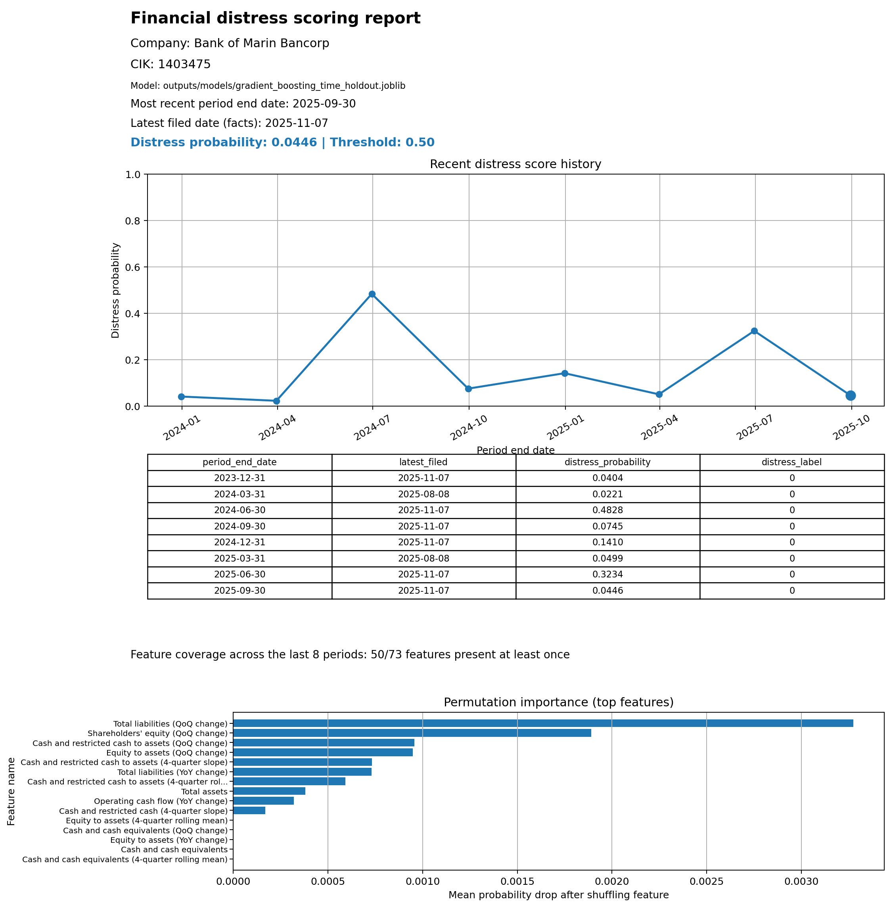
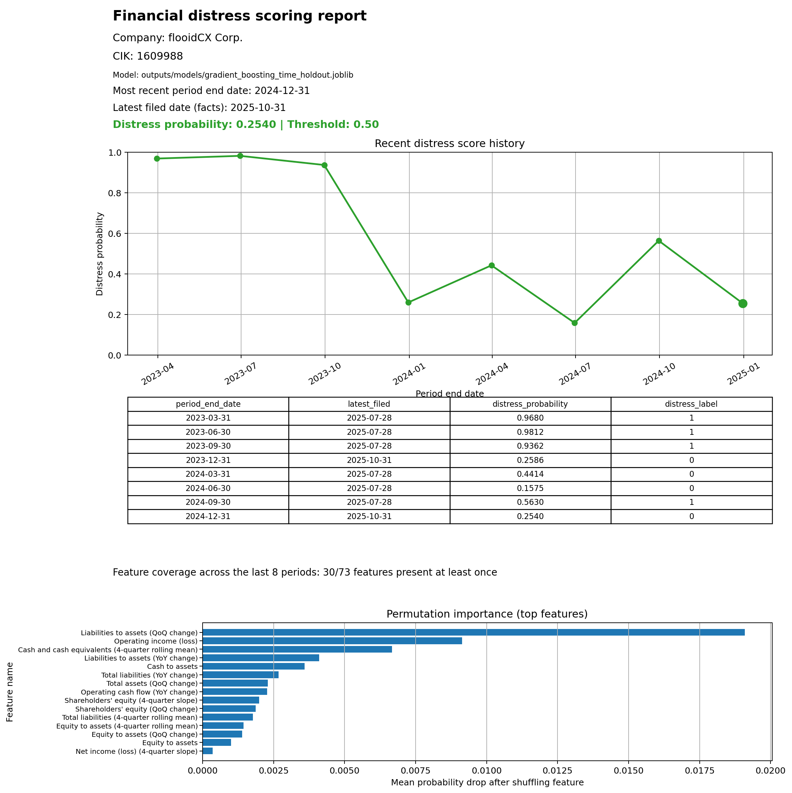
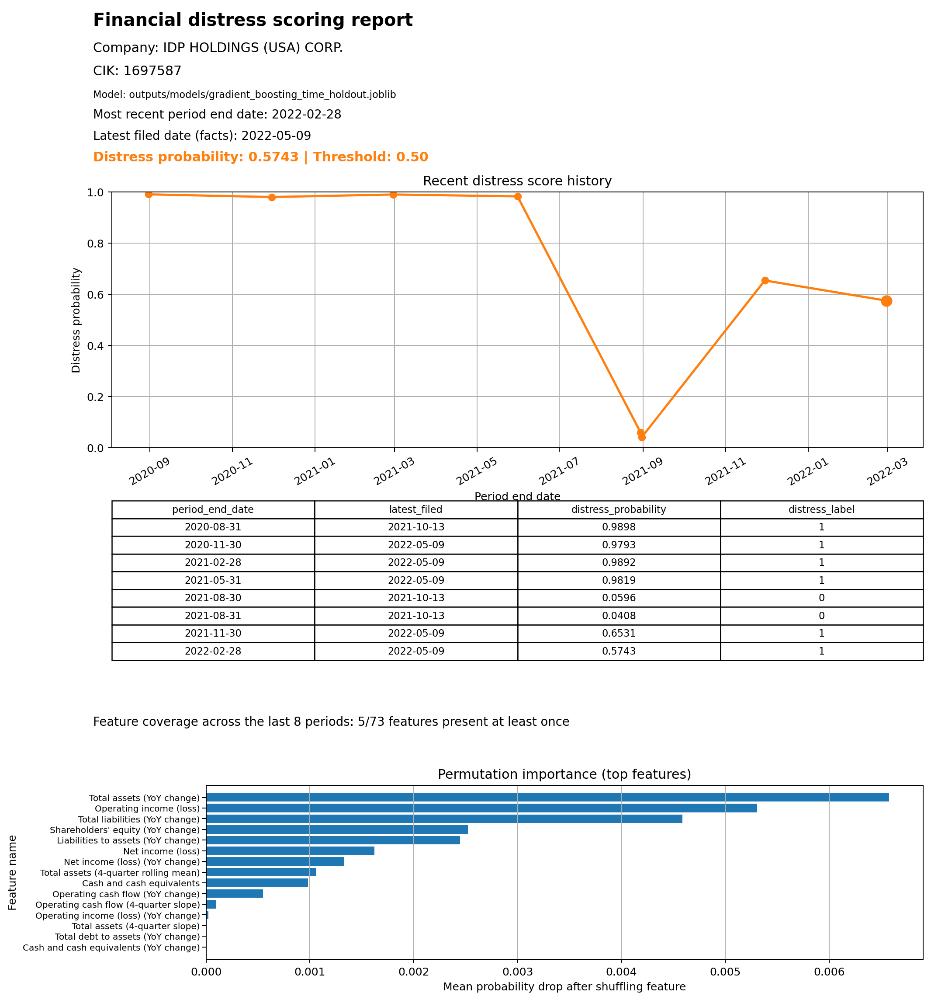
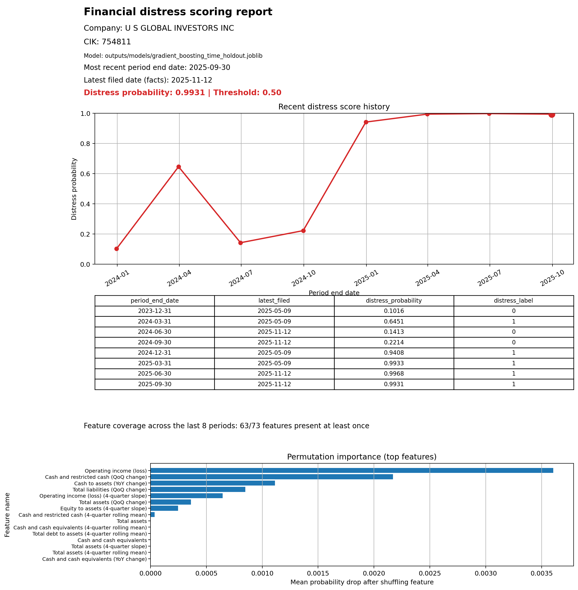

# Financial Distress Trend Modelling

*A longitudinal, time-aware framework for predicting financial distress trajectories using SEC XBRL filings.*

<p align="center">
  <a href="https://github.com/John-JonSteyn/FinancialDistressTrendModelling/stargazers" target="_blank" rel="noopener noreferrer">
    
  </a>
  <a href="https://github.com/John-JonSteyn/FinancialDistressTrendModelling" target="_blank" rel="noopener noreferrer">
    
  </a>
  <a href="https://github.com/John-JonSteyn/FinancialDistressTrendModelling/commits/main" target="_blank" rel="noopener noreferrer">
    
  </a>
  <a href="https://github.com/John-JonSteyn/FinancialDistressTrendModelling/blob/main/LICENSE" target="_blank" rel="noopener noreferrer">
    
  </a>
</p>

---

## Overview

This repository implements an end-to-end financial distress trend modelling pipeline using publicly available SEC XBRL filings.

Rather than predicting bankruptcy as a single binary event, the system focuses on early-warning distress signals by modelling financial deterioration trajectories over time.
The output is a probability-based assessment designed to support monitoring, triage, and intervention decisions rather than deterministic classification.

The project combines:

* Longitudinal financial statement feature engineering
* Time-aware model training and evaluation
* Live scoring from SEC company facts
* Automated, presentation-ready company reports

---

## Objectives

* Move beyond point-in-time credit risk assessment toward temporal distress modelling
* Engineer interpretable financial ratio, trend, and slope features from SEC filings
* Enforce strict time-based evaluation to avoid look-ahead bias
* Produce explainable, company-level reports suitable for professional review
* Demonstrate how academic models can be deployed against live regulatory data

---

## Example Outputs

Below are automatically generated, company-level distress reports based on the most recent available SEC filings.

### Stable example

<p align="center">
  
</p>

### Recovery example

<p align="center">
  
</p>

### Elevated risk example

<p align="center">
  
</p>

### High distress example

<p align="center">
  
</p>

Each report includes:

* Recent distress probability history
* Filing-aware timestamps
* Feature coverage diagnostics
* Permutation-based feature importance
* Visual stability indicators

---

## Methodology Summary

### Data Source

* SEC XBRL *company facts* API
* Quarterly and annual filings (10-Q / 10-K)
* No proprietary or forward-looking information

### Feature Engineering

* Core financial statement values (assets, liabilities, income, cash flow, debt)
* Financial ratios (leverage, margins, liquidity, coverage)
* Temporal dynamics:

  * Quarter-on-quarter changes
  * Year-on-year changes
  * Rolling means
  * Short-window slopes

### Modelling

* Gradient boosting classifier
* Trained on historical firm trajectories
* Evaluated using time-holdout splits and unseen-company splits
* Outputs probabilistic distress scores rather than hard predictions

### Scoring and Reporting

* Live SEC integration for unseen firms
* Latest N-quarter scoring window
* Automated CSV, JSON, and PNG report generation

---

## Repository Structure

```
data/
├─ raw/                         # Raw extracted SEC data
├─ processed/                   # Modelling tables and derived datasets
outputs/
├─ models/                      # Trained model pipelines
├─ tables/                      # Score histories, summaries, coverage tables
└─ figures/                     # Generated plots and reports
src/
├─ modelling/                   # Feature engineering and training code
├─ reporting/                   # SEC scoring and report generation
└─ utils/
docs/
└─ examples/                    # Example company reports
```

---

## Reproducibility Notes

* All feature engineering applied during company scoring mirrors the training pipeline exactly, including ratio construction, rolling windows, and trend calculations.
* Train-test splits are strictly time-based, preventing information leakage from future financial periods into model training.
* Randomised company selection for demonstration and report generation is deterministic through explicit seed control.
* All reports can be regenerated end-to-end from publicly available SEC XBRL filings using the saved model artefacts included in the repository.
* Minor numerical differences may occur over time due to updates or restatements in SEC filings, but model behaviour and pipeline logic remain fully reproducible.

## Reproducing the pipeline

The full modelling and reporting pipeline can be reproduced as follows:

```bash
# 1. Fetch and unpack SEC financial statement data
python src/data/fetch_and_unpack_sec_data.py

# 2. Build base financial tables and engineered features
python src/features/compute_financial_features.py

# 3. Define proxy distress labels
python src/labels/build_distress_proxy_labels.py

# 4. Generate time-based train-test splits
python src/models/model_data_split.py

# 5. Train the distress prediction model
python src/models/train_gradient_boosting.py

# 6. Score a company and generate a full report
python src/reporting/score_company_from_sec.py
```

---

## Research Context

This project develops a longitudinal financial distress modelling framework designed to identify early warning signals of corporate deterioration using publicly available SEC XBRL filings. The system models financial trajectories across multiple quarters, capturing changes in leverage, profitability, liquidity, and cash flow through engineered ratios and trend features.

A supervised learning model translates these evolving financial patterns into probabilistic risk assessments, supporting proactive monitoring and decision-making in investment, credit risk, and turnaround contexts where timely intervention is critical.

---

## Supporting Documentation

Additional methodological details are provided in the `docs/` directory:

* **[`dataset_provenance.md`](docs/dataset_provenance.md)**  
  Describes the origin, structure, filtering, and transformation of SEC XBRL data used throughout the pipeline.

* **[`label_definition.md`](docs/label_definition.md)**  
  Defines the proxy distress labelling strategy, including its rationale, assumptions, and limitations.

These documents are intended to support transparency, auditability, and academic review rather than day-to-day usage.


---

## License

This project is released under the MIT License. See the `LICENSE` file for details.
You are genuinely at a strong stopping point now.
